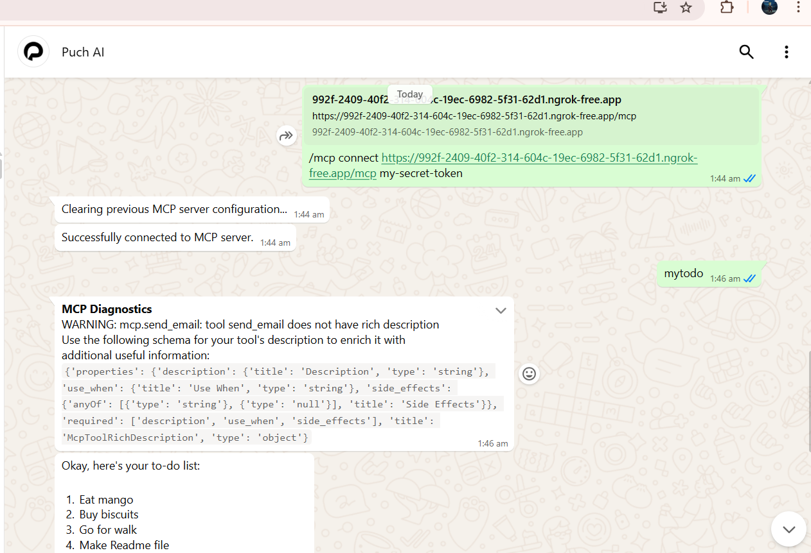

# Smart Email + To-Do MCP Server

A lightweight **Multi-Channel Processing (MCP)** server built using `FastMCP`, enabling natural language interactions for:

- 📧 Sending emails via Gmail SMTP  
- ✅ Managing an in-memory to-do list  

Easily connect it with platforms like **Puch AI** or your own custom interface.

---

## 🚀 Features

### 1.  Send Email

Send an email by simply typing a natural prompt.

** Example Prompt:**  
`Send email to someone@example.com subject Hello content Meeting at 5PM.`

** How It Works:**
- Uses Gmail SMTP (SSL, port 465)
- Requires a Gmail App Password ( not your normal password)
- Securely loads credentials from `.env`
- Responds with a success or failure message

---

### 2. To-Do List Management

Manage simple tasks that live in memory.

| Tool       | Description                         | Example Prompt                  |
|------------|-------------------------------------|----------------------------------|
| `todo`     | Add a task to the to-do list        | `Eat Mango`         |
| `mytodo`   | View all current tasks              | `what is my to-do list`          |
| `complete` | Mark task complete and remove it    | `Eat mango`     |

>  To-do items are **not persistent** — they are lost on server restart.

---

## 🔐 Authentication

This server uses **Bearer Token authentication**  ie.,  my-secret-token

###  Usage:

### 1. Create .env File
Create a .env file in your project root:

EMAIL_ADDRESS=your_email@gmail.com
EMAIL_PASSWORD=your_app_password

### Generate Gmail App Password
Follow these steps:
Go to: https://myaccount.google.com/security
Enable 2-Step Verification
Open App Passwords
Choose app: Mail, device: Other
Paste the generated password in .env as EMAIL_PASSWORD

### Access and Run

## Run the server 
`` python server.py``

Expose your local server to the internet:
The server is running on your local machine, but Puch AI needs a public URL to reach it. Use a tool like ngrok for this.

``ngrok http 8085``

ngrok will provide you with a public URL (e.g., https://random-string.ngrok.io). Copy this HTTPS URL.

Provide the URL to Puch AI:

Chat with Puch AI using the following link - https://s.puch.ai/puchai

Connect Puch AI to your MCP server using the following command:
``/mcp connect <your-public-ngrok-link>/mcp  my-secret-token ``

## Results

## Author
Shrivatsa Desai
[LinkedIn](https://www.linkedin.com/in/shrivatsa-desai-318109353/)
[X](https://x.com/SHRIvatsa_desai)
[Email](shrivatsaddesai@gmail.com)

